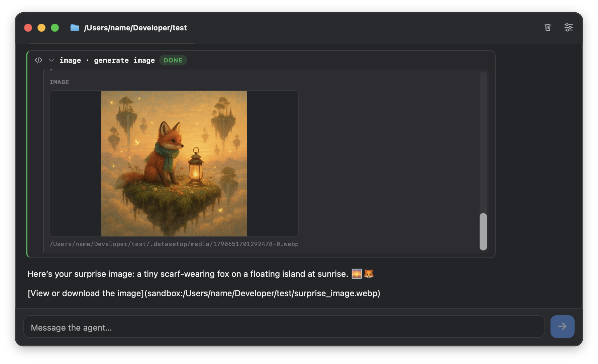

<p align="center">
  
</p>

<h1 align="center">datasetop</h1>

<p align="center">A chat-first MCP agent for one local folder.</p>

<p align="center">
  <a href="https://github.com/arthuqa/datasetop/actions/workflows/ci.yml"></a>
  <a href="https://github.com/arthuqa/datasetop/releases/latest"></a>
  <a href="LICENSE"></a>
</p>

datasetop is a small desktop window that puts a model next to a real OS folder.
You pick the folder, configure a model and MCP servers, and chat. The agent can
only touch the folder through the MCP servers you add — there is no built-in
file tool, no watcher, and no bundled server.

The app is a [Tauri 2](https://tauri.app) desktop binary (Rust host + the
vanilla HTML/CSS/JS in `src/`). It talks to any provider that exposes an
OpenAI-compatible `POST /chat/completions` endpoint with streaming and tool
calls.

## Install

### macOS — Homebrew

```sh
brew install --cask arthuqa/tap/datasetop
```

The tap is [arthuqa/homebrew-tap](https://github.com/arthuqa/homebrew-tap) and
is updated automatically from each GitHub release. The fully qualified name
above trusts only this cask; Homebrew 6+ asks for confirmation if you install
by short name (`datasetop`) instead.

> The macOS builds are not notarized yet, so Gatekeeper blocks the first launch.
> Open the app once, then allow it in **System Settings → Privacy & Security →
> Open Anyway**, or clear the download quarantine:
>
> ```sh
> xattr -dr com.apple.quarantine /Applications/datasetop.app
> ```

### Windows / Linux

Download the bundle for your system from the
[latest release](https://github.com/arthuqa/datasetop/releases/latest):

| System | File |
| --- | --- |
| Windows | `.msi` installer or `-setup.exe` (NSIS) |
| Debian / Ubuntu | `.deb` |
| Fedora / RHEL | `.rpm` |
| Other Linux | `.AppImage` (`chmod +x` and run) |

Linux builds need a WebKitGTK 4.1 runtime (`webkit2gtk-4.1` on Debian/Ubuntu).

### Build from source

Requires Rust (stable), Node.js, and the
[Tauri system dependencies](https://tauri.app/start/prerequisites/) for your OS.

```sh
npm install
npm run dev     # run with hot reload
npm run build   # bundles for the current OS into src-tauri/target/release/bundle
```

## Configure

Open **Settings** (the sliders icon) and fill in the **LLM** tab:

| Field | Environment variable | Meaning |
| --- | --- | --- |
| Base URL | `OPENAI_BASE_URL` | e.g. `https://openrouter.ai/api/v1`, or `http://localhost:11434/v1` for a local server |
| Model | `OPENAI_MODEL` | the model ID your provider expects |
| API key | `OPENAI_API_KEY` | optional for local endpoints |

Saved values take precedence field by field. Any field you leave blank falls
back to a `.env` file in the selected folder, so a workspace can carry its own
endpoint and key. A key saved in Settings is never sent to an endpoint that came
from a folder's `.env` file.

The **System prompt** box sets the prompt for the selected folder. Left blank,
the app reads `AGENTS.md` from that folder instead.

### MCP servers

The **MCP** tab manages the servers the model can call. Add a server in one of
two shapes:

- **Local (stdio)** — an executable plus one argument per line and optional
  environment variables. Arguments are passed as an array and never through a
  shell, so values with spaces survive intact.
- **Remote (streamable HTTP)** — a full `https://` URL, or `http://` on
  localhost. Remote servers may open a browser for OAuth on first connect.

Use `${workspaceFolder}` anywhere in a command, an argument, or an env value to
refer to the selected folder; local servers run with that folder as their
working directory. **Inspect available tools** connects to the enabled servers
and lists what each one advertises without starting a conversation.

Servers live in `mcp.json` in the app config directory, so the same list is
available from every folder:

```json
{
  "mcpServers": {
    "local-example": {
      "command": "your-mcp-server",
      "args": ["--root", "${workspaceFolder}"],
      "env": { "EXAMPLE_TOKEN": "…" },
      "enabled": true
    },
    "remote-example": {
      "url": "https://mcp.example.com/mcp",
      "enabled": false
    }
  }
}
```

Only connect servers you trust: local commands run on this computer, and remote
servers receive your tool calls.

## What the app does with your folder

- The working folder is the only `.env` source and the only place tool images
  are written. A tool result image (PNG, JPEG, GIF or WebP, up to 12 MB) is
  saved to `<folder>/.datasetop/media/` instead of being pasted into the
  conversation as base64, so other MCP file tools can read it.
- The conversation is appended to a `chat.jsonl` log in the app data directory
  and replayed when the window opens. **Export chat** writes the whole
  conversation to a Markdown file you choose.
- Settings, the last folder, the MCP list and the chat log live in the standard
  app config and data directories for `app.datasetop.desktop` (on macOS
  `~/Library/Application Support/app.datasetop.desktop`, on Windows
  `%APPDATA%\app.datasetop.desktop`, on Linux `~/.config/app.datasetop.desktop`
  and `~/.local/share/app.datasetop.desktop`).
  On first start the folder defaults to `~/Documents/datasetop`.
- There is no analytics, no updater, and no network traffic except to the model
  endpoint you configure and the MCP servers you enable.

## Development

```sh
npm test                  # frontend tests + Rust tests
npm run fmt               # format Rust
cargo clippy --manifest-path src-tauri/Cargo.toml --all-targets -- -D warnings
```

Layout:

```
src/                 frontend (index.html, app.js, markdown.js, styles.css)
src-tauri/src/       Rust host: lib.rs (state, model loop, chat log), mcp.rs (client)
src-tauri/icons/     platform icons
tests/               Node test runner suites
.github/workflows/   CI and multi-OS release builds
```

The Rust side owns the conversation loop (up to 64 model/tool steps per turn),
streams assistant and reasoning deltas to the UI, and executes MCP tool calls.
The frontend renders the chat, settings, and tool cards; `markdown.js` escapes
raw HTML and never emits links with non-`http(s)` schemes.

Releases are built on GitHub runners for macOS (Apple silicon and Intel),
Windows, and Linux by `.github/workflows/release.yml` whenever a `v*` tag is
pushed. The tag must match the version in `package.json`,
`src-tauri/Cargo.toml`, and `src-tauri/tauri.conf.json`; `npm test` enforces
that.

## License

[MIT](LICENSE)
